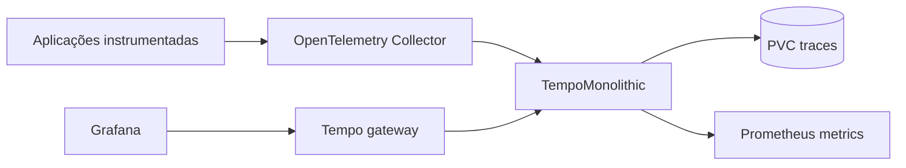

# Tempo GitOps

Red Hat OpenShift Distributed Tracing Platform em modo `TempoMonolithic`,
dimensionado para OpenShift Local. Recebe OTLP por gRPC/HTTP, persiste traces
em um PVC de 10 GiB e publica métricas operacionais para Prometheus.


## Arquitetura



No CRC o perfil usa `TempoMonolithic` por simplicidade e baixo consumo. Para
produção, o README documenta quando avaliar `TempoStack` com object storage e
alta disponibilidade.

## Fluxo

```text
aplicações -> OpenTelemetry Collector -> TempoMonolithic -> Grafana
```

O Collector do repositório `opentelemetry-gitops` é o ponto de entrada
recomendado: ele aplica limites/batching, exporta para Tempo e gera métricas RED
com exemplares. O Grafana correlaciona métricas, traces e logs.

## Deploy

```bash
oc apply -k overlays/desenvolvimento
oc -n openshift-tempo-operator get subscription,csv,pods
oc -n openshift-tempo-operator get tempomonolithic,pvc,service
```

Validação declarativa:

```bash
oc kustomize overlays/desenvolvimento >/tmp/tempo.yaml
oc apply --dry-run=server -f /tmp/tempo.yaml
```

## Drilldown e TempoStack

Esta implantação oferece busca, TraceQL e visualização de traces no Grafana. As
métricas RED contínuas que alimentam navegação, dashboards e links de
`tracesToMetrics` vêm do connector `span_metrics` do repositório
`opentelemetry-gitops`.

O Service Graph completo exige métricas de grafo (`traces_service_graph_*`)
geradas pelo Tempo metrics-generator, Grafana Alloy ou outro pipeline
compatível. No CRC atual eu mantive `TempoMonolithic`: ele é leve, usa PVC
local e evita introduzir MinIO/S3 apenas para laboratório.

TraceQL metrics e recursos recentes de Traces Drilldown variam com a versão do
backend entregue pelo Operator. Verifique primeiro o CSV e a imagem em execução,
em vez de assumir equivalência com o Tempo comunitário mais recente.

`TempoStack` é o caminho recomendado para ambientes maiores ou produção, mas
requer object storage suportado (MinIO, S3, Azure, GCS ou OpenShift Data
Foundation) e configuração de tenants/permissões. Use `TempoStack` quando você
quiser HA, retenção formal, object storage e metrics-generator como parte do
backend; para o CRC local, o custo operacional não compensa por padrão.

## Limites do perfil local

- uma única instância, sem alta disponibilidade;
- backend em PVC local;
- retenção/capacidade limitadas pelo volume;
- sem Route pública para ingestão;
- sem object storage, replicação ou disaster recovery.

Para produção, use `TempoStack`, object storage, autenticação multi-tenant,
criptografia, políticas de retenção, metrics-generator e sizing baseados no
volume de spans.

Referências: [Distributed Tracing no OpenShift](https://docs.redhat.com/en/documentation/openshift_container_platform/4.20/html/distributed_tracing/)
e [Grafana Tempo](https://grafana.com/docs/tempo/latest/). Para o ponto do
Drilldown, veja também [Grafana Drilldown](https://grafana.com/docs/grafana/latest/visualizations/simplified-exploration/),
[métricas a partir de traces](https://grafana.com/docs/tempo/latest/metrics-from-traces/)
e [Service Graph](https://grafana.com/docs/tempo/latest/metrics-from-traces/service_graphs/service-graph-view/).

## Ambientes e validação

```bash
oc kustomize overlays/desenvolvimento >/tmp/tempo-dev.yaml
oc kustomize overlays/aceite >/tmp/tempo-aceite.yaml
oc kustomize overlays/producao >/tmp/tempo-prod.yaml
oc apply --dry-run=client -k overlays/desenvolvimento
```

`storageClassName` não é fixado; o cluster usa a StorageClass padrão ou o
overlay deve patchar a classe. `aceite` e `producao` aumentam o tamanho do PVC,
mas produção real deve avaliar `TempoStack` com object storage/HA. Veja
`docs/AMBIENTES.md`.
